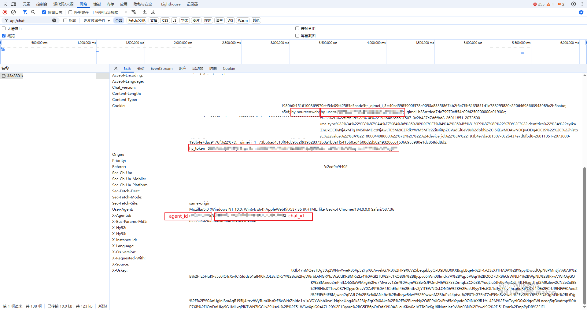

# YuanBao-Free-API ✨

一个允许您通过 OpenAI 兼容接口访问腾讯元宝的服务。

## ✨ 核心特性

✅ **完整兼容 OpenAI API 规范**  
🚀 **支持主流元宝大模型**（DeepSeek/HunYuan系列）  
⚡️ **流式输出 & 网络搜索功能**  
🖼️ **支持上传图片或文件**  
📦 **开箱即用的部署方案**（本地/Docker）  

## ⚠️ 使用须知

- 本项目仅限**学习研究用途**
- 请严格遵守腾讯元宝的[使用条款](https://yuanbao.tencent.com/)
- `hy_token` 有时效性，过期需重新获取

## 🚀 快速开始

### 环境准备
```bash
git clone https://github.com/chenwr727/yuanbao-free-api.git
cd yuanbao-free-api
pip install -r requirements.txt
```

## 🖥️ 服务端部署

### 本地运行
```bash
# 服务地址：http://localhost:8000
python app.py
```

### Docker部署
```bash
# 构建镜像
docker build -t yuanbao-free-api .

# 运行容器
docker run -d -p 8000:8000 --name yuanbao-api yuanbao-free-api
```

## 📡 客户端调用

### 认证参数获取
#### 手动获取

1. 访问[腾讯元宝](https://yuanbao.tencent.com/)
2. 打开开发者工具（F12）
3. 捕获对话请求获取：
   - Cookie中的 `hy_user` 和 `hy_token`
   - 请求体中的 `agent_id`

#### 自动获取
```bash
# 扫码登录后自动输出认证参数
python get_cookies.py
```

### API调用示例
```python
import base64

import requests
from openai import OpenAI

base_url = "http://localhost:5050/v1/"

hy_source = "web"
hy_user = ""    # 替换为你的用户ID
hy_token = ""   # 替换为你的token

agent_id = "naQivTmsDa"
chat_id = ""    # 可选，如果不提供会自动创建

# upload
url = base_url + "upload"

file_name = "example.png"
with open(file_name, "rb") as f:
    file_data = base64.b64encode(f.read()).decode("utf-8")
data = {
    "agent_id": agent_id,
    "hy_source": hy_source,
    "hy_user": hy_user,
    "file": {
        "file_name": file_name,
        "file_data": file_data ,
        "file_type": "image",   # 只能是 image 或 doc
    },
}
headers = {"Authorization": f"Bearer {hy_token}"}
response = requests.post(url, json=data, headers=headers)
if response.status_code == 200:
    print("File uploaded successfully:", response.json())
    multimedia = [response.json()]
else:
    print("File upload failed:", response.status_code, response.text)
    multimedia = []
print(multimedia)

# chat
client = OpenAI(base_url=base_url, api_key=hy_token)

response = client.chat.completions.create(
    model="deepseek-v3",
    messages=[{"role": "user", "content": "这是什么？"}],
    stream=True,
    extra_body={
        "hy_source": hy_source,
        "hy_user": hy_user,
        "agent_id": agent_id,
        "chat_id": chat_id,
        "should_remove_conversation": False,
        "multimedia": multimedia,
    },
)

for chunk in response:
    print(chunk.choices[0].delta.content or "")
```

## 🧠 支持模型

| 模型名称              | 特性说明                    |
|----------------------|-----------------------------|
| deepseek-v3          | 深度求索 V3 基础模型         |
| deepseek-r1          | 深度求索 R1 增强模型         |
| deepseek-v3-search   | 深度求索 V3 模型（带搜索功能）|
| deepseek-r1-search   | 深度求索 R1 模型（带搜索功能）|
| hunyuan              | 腾讯混元基础模型             |
| hunyuan-t1           | 腾讯混元 T1 模型             |
| hunyuan-search       | 腾讯混元模型（带搜索功能）    |
| hunyuan-t1-search    | 腾讯混元 T1 模型（带搜索功能）|

## 🌟 应用案例

[FinVizAI](https://github.com/chenwr727/FinVizAI) 实现多步骤金融分析工作流：
- 实时资讯搜索分析
- 市场趋势数据集成
- 结构化报告生成

## 📜 开源协议

MIT License © 2025

## 🤝 参与贡献

欢迎通过以下方式参与项目：
1. 提交Issue报告问题
2. 创建Pull Request贡献代码
3. 分享你的集成案例